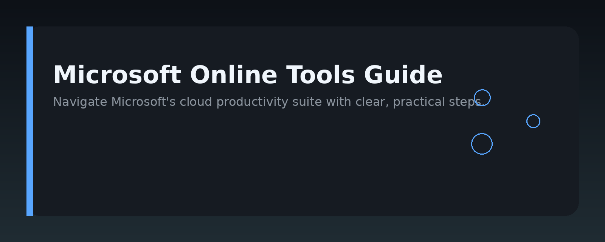
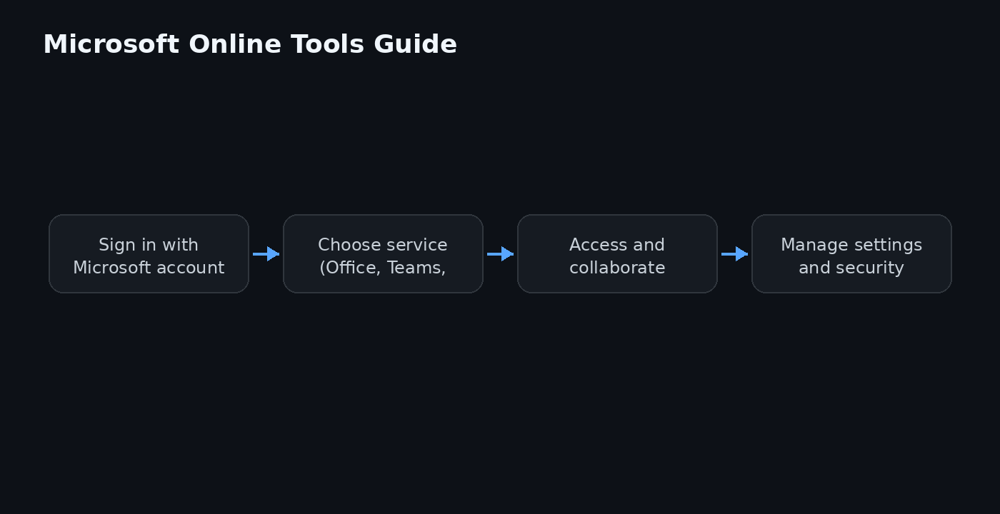

# Microsoft Online Tools Guide




## Overview

This repository is a practical, developer-oriented guide to Microsoft online tools. It covers the web-based services and APIs that Microsoft offers for productivity, collaboration, development, and automation — from Microsoft 365 and Power Platform to Azure portal tools and developer utilities. The focus is on how these tools work together, how to integrate them into your own workflows, and where to find the official documentation for deeper dives.

## Why it exists

Microsoft online tools are powerful but sprawling. The official docs are thorough, yet often scattered across separate product sites, making it hard to see the full picture. This guide exists to give developers a single, coherent starting point: what each tool does, when to use it, and how it connects to the rest of the Microsoft online ecosystem. It is not a replacement for official documentation — it is a map to help you navigate it faster.

## Core concepts

- **Microsoft 365 online services** — cloud-hosted productivity apps (Outlook, Teams, SharePoint, OneDrive) with REST APIs and Graph endpoints for programmatic access.
- **Power Platform** — low-code tools (Power Apps, Power Automate, Power BI) that integrate with Microsoft online data sources and external services.
- **Azure portal and services** — web-based management for cloud resources, including identity (Entra ID), storage, and serverless functions.
- **Microsoft Graph** — the unified API gateway for Microsoft 365 data, enabling you to read and write mail, calendar, files, and users from a single endpoint.
- **Authentication** — OAuth 2.0 and Microsoft Entra ID (formerly Azure AD) are the common security layer across most Microsoft online tools.

## Architecture

The diagram above shows the typical layering: client apps (web, mobile, desktop) authenticate against Microsoft Entra ID, then call Microsoft Graph or product-specific REST APIs to reach Microsoft 365 services. Power Platform sits on top of the same identity and data layers, while Azure portal tools manage the underlying infrastructure. This guide follows that same structure — identity first, then data access, then automation and low-code layers.

## Practical workflow

1. **Register an app** in Microsoft Entra ID to get a client ID and set permissions for the Microsoft online APIs you need.
2. **Authenticate** using the OAuth 2.0 flow appropriate for your scenario (authorization code, client credentials, or device code).
3. **Call Microsoft Graph** to read or write data — for example, list a user's recent emails or upload a file to OneDrive.
4. **Automate** repetitive tasks with Power Automate flows or Azure Functions, using the same Graph endpoints.
5. **Monitor and manage** resources through the Azure portal, keeping an eye on quotas, logs, and access reviews.

## Examples

### 1. Get a user's profile with Microsoft Graph (Python)

```python
import requests

# Use an access token obtained via OAuth 2.0
headers = {"Authorization": "Bearer YOUR_ACCESS_TOKEN"}
response = requests.get("https://graph.microsoft.com/v1.0/me", headers=headers)
print(response.json())
```

### 2. List recent emails (PowerShell)

```powershell
$token = "YOUR_ACCESS_TOKEN"
$headers = @{ Authorization = "Bearer $token" }
$uri = "https://graph.microsoft.com/v1.0/me/mailFolders/inbox/messages?`$top=5"
Invoke-RestMethod -Uri $uri -Headers $headers | ConvertTo-Json -Depth 3
```

### 3. Create a SharePoint list item (REST)

```http
POST https://{tenant}.sharepoint.com/sites/{site}/_api/web/lists/getbytitle('Tasks')/items
Authorization: Bearer YOUR_ACCESS_TOKEN
Content-Type: application/json

{
  "Title": "Review the Microsoft online tools guide",
  "Status": "In progress"
}
```

### 4. Trigger a Power Automate flow from an HTTP request

```http
POST https://prod-XX.westus.logic.azure.com:443/workflows/{flow-id}/triggers/manual/paths/invoke?api-version=2016-06-01
Content-Type: application/json

{
  "message": "Started from a custom app"
}
```

## FAQ

**Do I need a Microsoft 365 subscription to use these tools?**
For most Graph and Power Platform features, yes — you need a work or school account with a Microsoft 365 plan. Some Azure portal tools and developer accounts are free, but data-heavy services require a paid subscription.

**What is the difference between Microsoft Graph and the SharePoint REST API?**
Microsoft Graph is the unified API for all Microsoft 365 data, while the SharePoint REST API is specific to SharePoint sites and lists. Use Graph when you need cross-service data; use the SharePoint API for site-specific operations that Graph does not yet expose.

**How do I get an access token?**
Register an app in Microsoft Entra ID, configure the required permissions, then use one of the OAuth 2.0 flows. Microsoft provides SDKs and sample code for Python, .NET, JavaScript, and other languages.

**Are these tools only for enterprise developers?**
No. Individual developers can use free tiers, developer accounts, and personal Microsoft accounts for many online tools, though some enterprise features (like admin APIs) require a tenant with appropriate roles.

**Where can I find the official documentation?**
For each tool, the official docs are linked from the Microsoft Learn site. This guide points you to the right product, but always verify API details against the current official reference.

## License

MIT

Topic: `microsoft-online-tools`
